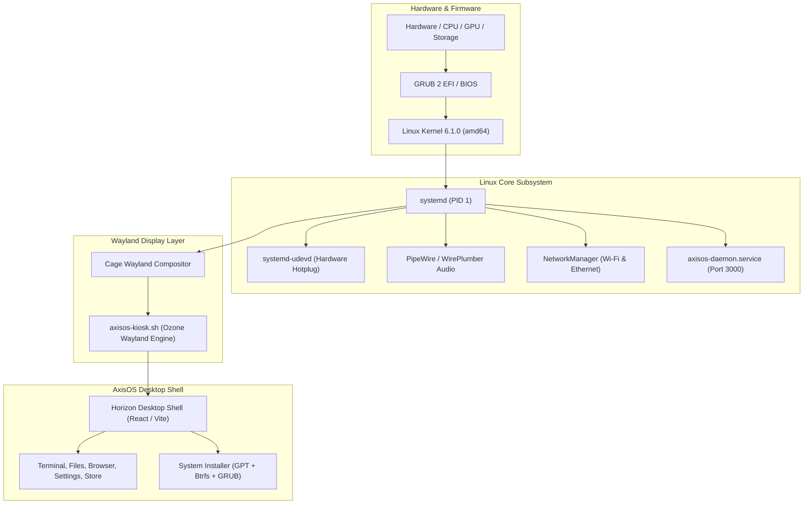

# AxisOS — Production Linux Operating System

<div align="center">

  <h1>▲ AxisOS 2.0 "Horizon"</h1>
  <p><b>A modern, fluid, glassmorphic Linux operating system built on Debian, the Cage Wayland compositor, and a hardware-accelerated desktop shell.</b></p>

  <p>
    <a href="https://github.com/u25282141-blip/AxisOS/releases"></a>
    
    
    
    <a href="LICENSE"></a>
  </p>

  <p>
    <a href="./INSTALLATION_GUIDE.md"><b>📖 Installation Guide</b></a> •
    <a href="./DEVELOPMENT.md"><b>🛠️ Build & Developer Guide</b></a> •
    <a href="./CONTRIBUTING.md"><b>🤝 How to Contribute</b></a> •
    <a href="https://github.com/u25282141-blip/AxisOS/releases"><b>⬇️ Releases</b></a>
  </p>

</div>

---

## 🌟 Overview

**AxisOS** is an independent, production-grade Linux operating system designed for performance, security, and aesthetics. Combining the power of the Linux kernel and the speed of the **Cage** Wayland kiosk compositor, AxisOS delivers a seamless desktop experience backed by an asynchronous system management daemon and native desktop applications.

---

## 🚀 Key Features

- **Fluid Desktop Shell**: Hardware-accelerated glassmorphism powered by React 19, Vite, and Tailwind CSS, featuring an interactive window manager, dynamic dock, top menu bar, and Control Center.
- **Axis Browser**: Chromium-based web browser with multi-tab browsing, bookmark speed-dial, and secure browsing controls.
- **High-Performance File Manager**: Asynchronous I/O operations queue (speed in MB/s, ETA, progress), inotify filesystem synchronization, XDG Trash specification compliance (`~/.local/share/Trash`), and dynamic USB block storage hotplugging.
- **Advanced Terminal & REPL**: Custom POSIX shell engine with tokenization, ANSI color rendering, piping (`|`), file descriptor redirection (`>`, `>>`), signal handling (`Ctrl+C`), and exit status prompts.
- **Atomic A/B Update Engine (`axis update`)**: Dual-partition system updates with zero risk of broken states, bootloader rollbacks, and `--fast-boot` near-instant kernel switching via `kexec`.
- **System Settings & Hardware Control**: Master-detail configuration pane for Wi-Fi (NetworkManager), Bluetooth (BlueZ), PipeWire/WirePlumber audio, display scaling, themes, and power management.
- **Axis Store**: Discover, install, and manage system packages and desktop software with live progress logging.
- **Real OS Installer**: Production installation wizard supporting automated GPT partitioning, Btrfs subvolumes (`@`, `@home`, `@snapshots`) with zstd compression, and GRUB EFI bootloader configuration.

---

## 🏗️ Architecture



---

## 📚 Documentation & Guides

To keep our repository organized and easy to navigate, detailed instructions have been segmented into dedicated guides:

| Document | Description |
| :--- | :--- |
| **[📖 Installation Guide](INSTALLATION_GUIDE.md)** | Step-by-step instructions for flashing to USB (Rufus, BalenaEtcher, Ventoy, `dd`), BIOS/UEFI setup, and bare-metal installation. |
| **[🛠️ Build & Developer Guide](DEVELOPMENT.md)** | Complete guide to installing dependencies, running local dev servers, compiling C modules, building the ISO, and running QEMU. |
| **[🤝 Contributing Guidelines](CONTRIBUTING.md)** | Code of conduct, pull request workflow, coding standards, and commit conventions. |
| **[📦 Package Manager Guide](pkg-mgr/README.md)** | Architecture and usage for the native `axis` package manager. |

---

## ⚡ Quick Start for Developers

For complete setup instructions, please see the **[Development Guide](DEVELOPMENT.md)**.

```bash
# 1. Clone repository
git clone https://github.com/u25282141-blip/AxisOS.git
cd AxisOS

# 2. Install desktop shell dependencies
cd shell
npm install

# 3. Launch development server
npm run dev

# 4. In a separate terminal, launch the system daemon
npm run serve
```

---

## 🗓️ Release Roadmap

- **v1.0 "Horizon"**: Initial live ISO release with Wayland kiosk, installer, and core apps.
- **v2.0 "Horizon v2"** *(December Release)*:
  - Chromium-based Axis Browser integration
  - Linux kernel platform and character driver stack
  - High-performance File Manager with XDG trash and USB hotplugging
  - Dual-partition atomic updates (`axis update`) with `kexec` fast boot
  - Full-featured POSIX Terminal emulator and REPL engine
  - Production ISO release

---

## 📄 License

AxisOS is free and open-source software licensed under the **GNU General Public License v3.0 (GPL-3.0)**. See the [LICENSE](LICENSE) file for details.
